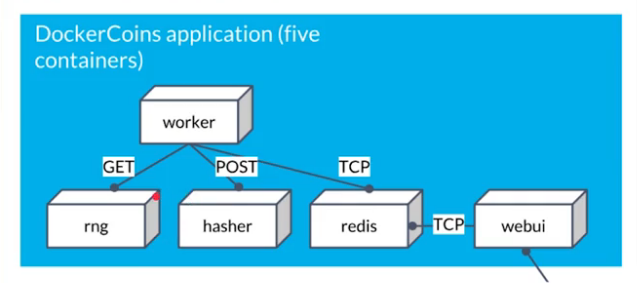

Kubernetes Demo
====================

About this repository:

**dockercoins**: application
**k8c**: accessories file

## Architecture

	

		
	

## Steps

1. Go to *dockercoins* folder and run the services with docker compose:

		docker-compose up

2. In the browser go to the IP: `0.0.0.0:8000/`

## Minikube / Linux 64

[Docs](https://minikube.sigs.k8s.io/docs/start/)

1. Install minikube

		$ curl -LO https://storage.googleapis.com/minikube/releases/latest/minikube_latest_amd64.deb

		$ sudo dpkg -i minikube_latest_amd64.deb

2. Start cluster

		$ minikube start

3. Show minicube status

		$ minikube status

4. Get minicube cluster IP

		$ minikube ip

5. Open dashboard

		$ minikube dashboard

## Deploy applications

1. Install kubectl

		$ snap install kubectl --classic

2. Create a sample deployment and expose it on port 8080:

		$ kubectl create deployment hello-minikube --image=k8s.gcr.io/echoserver:1.4
		$ kubectl expose deployment hello-minikube --type=NodePort --port=8080

3. To access this service through a web browser

		$ minikube service hello-minikube

4. Run to show services

		$ kubectl get services hello-minikube

5. Alternatively, go to minicube IP and hello-minikube port

6. To access cluster

		$ kubectl get po -A

7. Show all services

		$ kubectl get service

8. Get nodes

		$ kubectl get nodes

## Recommended

* [Kubernetes The Hard Way](https://github.com/kelseyhightower/kubernetes-the-hard-way)
* [minikube](https://github.com/kubernetes/minikube)
